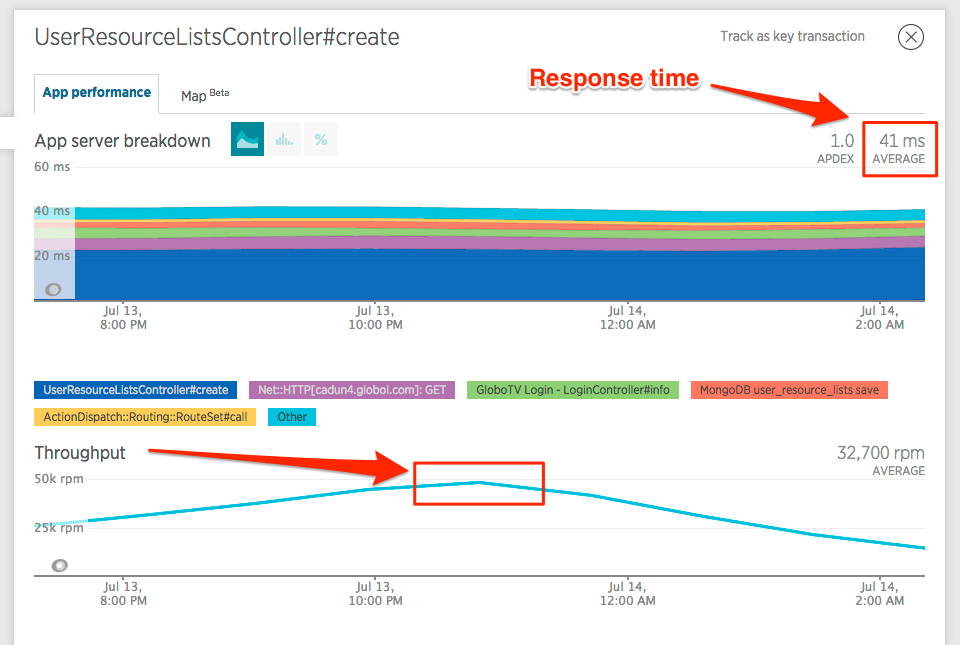
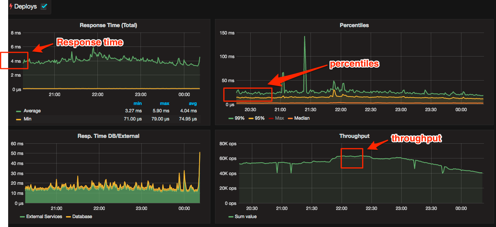

### How Elixir helped us scale our Video User Profile Service for the Olympics

I'm learning Elixir since the end of 2014 when [version 1.0 was launched](http://elixir-lang.org/blog/2014/09/18/elixir-v1-0-0-released/). I'm not a Guru, I'm just starting, but loving it. Like any other new technology, first I like to read some books, do some personal experiments, freelancers, try it with non-critical projects in the company and then do something that solves real problems and fits in the technology purpose. So, I'll talk a little bit about the first big project I did with Elixir.

#### Context

I work at [Globo.com](http://globo.com) with Online Video. [Globo.com](http://globo.com) is the Internet arm of one of the 5 largest media conglomerates in the world and absolute leader in Latin America. I'm proud to have worked with many talented people during all my journey and for now, I met another one, my new friend [Luiz Filho](https://twitter.com/luizbafilho), which is being my partner in this journey , trying to do something with real value with this amazing new technology. Together with us are also our intern, [Bernardo Lins](https://github.com/bernardolins), one of the bests interns I've worked during my entire career. He was also very motivated to learn and master Elixir.

#### The problem

3 months ago, we inherited a well written Ruby on Rails application, called User Profile API, a software responsible for giving our Online Video Products, [Globo Play](http://globoplay.globo.com) and [Globosat Play](http://globosatplay.globo.com) a logged experience, so the user can mark a video to watch later, adds to favorites, continue watching when it stopped, store preferences, etc. With the user proactive actions, we also have a notification about the watch progress on every 10 seconds, so we can provide the keep watching function on any device. Here are some screenshots:

*Globo Play add to favorites*

*Globosat Play keep watching*

This API provided the logged user experience, and it was written in 2012, to first be used in [Globo.TV](http://web.archive.org/web/20140517100704/http://globotv.globo.com/), our old video product. That version was perfect to met [Globo.TV](http://web.archive.org/web/20140517100704/http://globotv.globo.com/) expectations. Since we launched [Globosat Play](http://globosatplay.globo.com) in 2013 and [Globo Play](http://globoplay.globo.com) in 2015, with all mobile and TV Connected Apps, the User Profile API throughput increased 6x, in a few months. In this scenario, we had some performance issues, basically with how Ruby and Rails work. Although this application problem does not prevent users from watching videos, our concern was to not give the users a poor experience, when they were in a logged session. The infrastructure for this RoR application was **4 bare metals (it started with 2 and we duplicated), each one with 24 CPUs and 64GB of RAM**.

#### Our First Try

In June, we were 2 months to [Rio 2016 Olympic games](https://en.wikipedia.org/wiki/2016_Summer_Olympics), and one of our missions was to make sure every application would be ready to a probably highest throughput demand during the event. We had 58 live video broadcast, 2 for [Globo Play](http://globoplay.globo.com) and another 56 for [Globosat Play](http://globosatplay.globo.com), so we expected traffic increase. We moved the application to our Open Source [PaaS](https://en.wikipedia.org/wiki/Platform_as_a_service), called [Tsuru](https://tsuru.io/). We replaced the infrastructure with **93 containers, each one with 2GB of RAM**.

Also with this, we did some optimizations to external services access and we also upgraded Rails and Ruby and all application libraries to the most recent stable versions, but we were still worried about the Olympics and we decided to try something else.

#### Ruby on Rails performance

Everybody knows that Ruby and especially Rails are two very good tools to develop applications. You have awesome productivity, great syntax and a strong community. But also, it's mainstream that they not perform well for high throughput applications, especially those who can't have a cache layer using a [Reverse Proxy](https://en.wikipedia.org/wiki/Reverse_proxy). It always blocks the entry process for each request, and although we have some great initiatives like [JRuby](http://jruby.org/) and [EventMachine](http://rubyeventmachine.com/), all ecosystem is tied to this programming model and the MRI is also not on the list of better VMs. It also lacks a great concurrency and parallelism model, due now we are dealing with multi-core CPUs and geo-distributed applications.

#### Elixir comes

After we decided to try Elixir, we took a look at New Relic metrics and we saw that there was a route with 80% of throughput and was a POST route, that saves all logged users interactions with our video products. We started to rewrite this route in Elixir, so we could leave only 20% with the Ruby on Rails Application. I'll not detail all the implementation in this article. I guess it will be better to write another one, so I can focus on every detail of our issues, challenges, tools and so one. Just to present the basics, we did it using [Elixir 1.3.2](http://elixir-lang.org/), [OTP 19](http://erlang.org/doc/), and [Phoenix](http://www.phoenixframework.org/) 1.1. After the basics, let's focus on the results of this route rewrite, which was a great success. I'll present this with the details at [Ruby Conf Brasil](http://www.rubyconf.com.br/en), this month.

#### Comparing metrics

Without metrics, it's useless to compare two versions of the same software. So, in the Ruby version, here is the [New Relic](https://newrelic.com/) screenshot for the route we rewrote:

Unfortunately, New Relic only preserves percentiles for the last 7 days, and we missed these screenshots, but we can see that **the max response time was around 4 seconds, we have notes about the 95 and 99 was around 500ms and 1.5s respectively**. We all know that is a big problem for Ruby, because it blocks the entry process until the round-trip is finished.

For the Elixir version, we do not have New Relic Agent yet, so we did an Ad-hoc solution, using Exometer + Logstash + Grafana. I'll explain it in the article about the implementation details. Here are the results:

After this rewrite, the performance for the same throughput went **from ~40ms in avg to ~4ms in avg**.

#### Computational units reduction

As I said in the beginning, we started with **4 bare metals** with **24 CPUs each and 64GB of RAM** for the first RoR application. After our first try, we changed it to **93 docker containers each one with 1 CPU to 2GB of RAM**.

Changing the POST route to Elixir which represents **80% of throughput**, we reduced from **93 containers with 2GB of RAM to 33 containers, 30 (with 2GB of RAM) for the RoR routes** and **3 (with 1GB of RAM) for the Elixir POST route.** Just to remember, all containers have **only 1 CPU**. The total reduction was **60 containers** for the second try, and comparing to the beginning, we came from **4 bare metals each one with 24 CPUs and 64GB of RAM to 33 containers, each one with 1CPU and 1-2GB of RAM**. This change also gave us better use of resources, since the **BEAM VM can operate with high CPU usage** without compromise application performance.

### Conclusion

Elixir is production ready since 2 years ago. The Erlang BEAM VM is safe and mature for more than 30 years. The language is being the cutting edge for the Ruby community, since important Ruby and Rails members, starting with [Jose Valim](https://twitter.com/josevalim), the creator of this language that was one of the most important members of the Rails Core Team. There is also Dave Thomas (the author of Ruby Pickaxe book) and many others. The language has many inspirations from Ruby and Rails syntax, and their tooling, making the transition not too hard and bringing a solid environment to the next generation of our applications, achieving the performance, throughout and distribution needs these applications have from the past few years to ahead.

### Update

I already wrote [the teardown article](https://blog.emerleite.com/elixir-video-user-profile-service-for-the-olympics-application-teardown-56ac3e103d1a).
