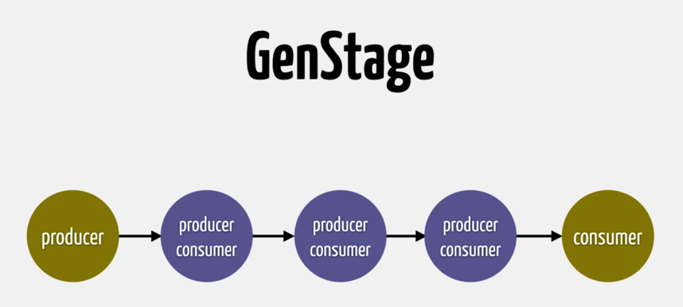
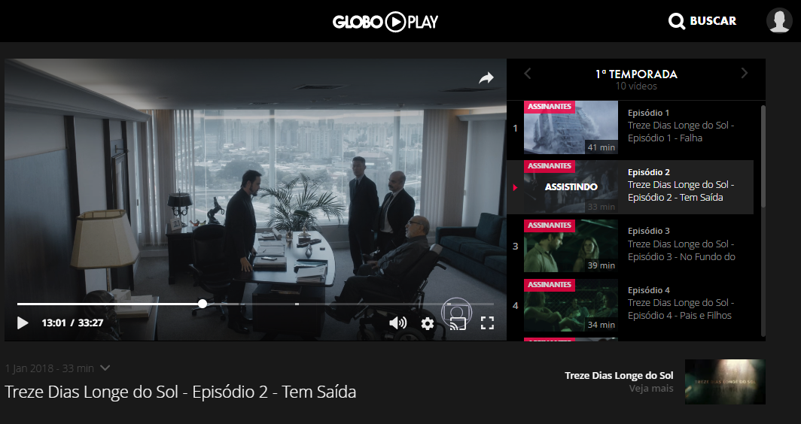
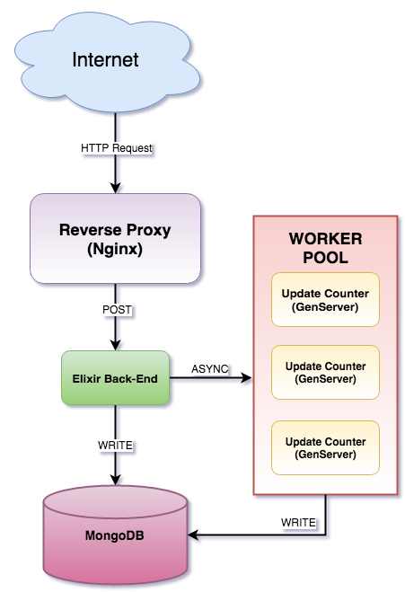
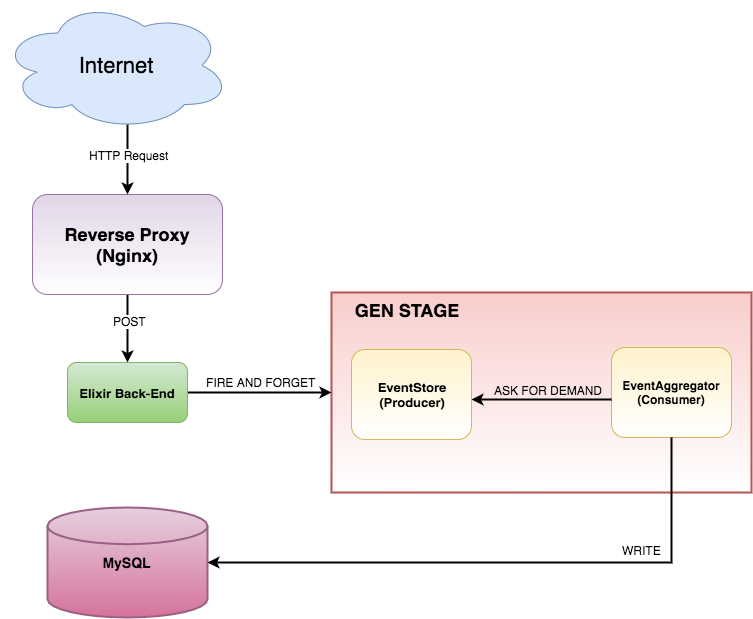
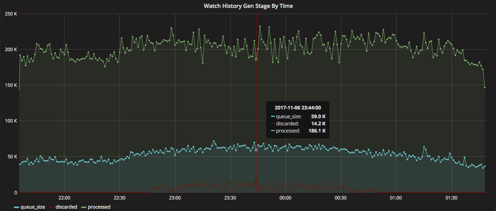
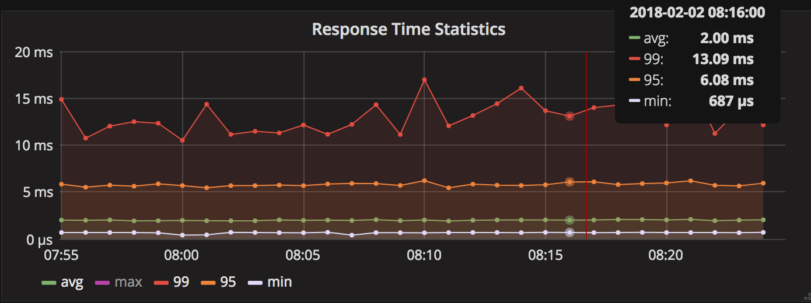
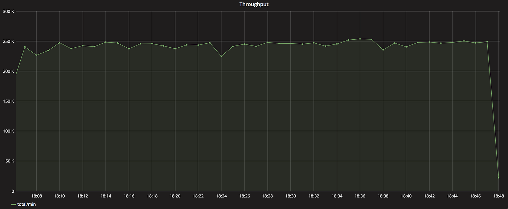

After working with Elixir for the past two years, I learned about [GenStage](https://hexdocs.pm/gen_stage/GenStage.html) and applied in a project at Globo.com. I'll talk about this experience and guess somehow it helps you.

In the end of 2016, [I wrote two blog posts about how we have used Elixir to scale Globo.com's Video User Profile Service](https://blog.emerleite.com/elixir-video-user-profile-service-for-the-olympics-application-teardown-56ac3e103d1a). So far, the approach descrided in that article has show us huge benefits and [marked the start of widespread adoption of Elixir at the company](https://blog.emerleite.com/full-video-the-conf-brasil-2017-4dd7e0303f7a).

### Context

To recap, [Globo.com](http://globo.com/) is the Internet arm of one of the 5 largest media conglomerates in the world and absolute leader in Latin America.

The *Video Watch Progress Service* has it's primary purpose allowing logged-in users to resume watching their videos at the point they stopped. **It updates the last watch progress every 10 seconds**. It's very important to give our users a better experience, especially when they're binge watching.

### The first version

[The goal for this first version was to rewrite a single endpoint](https://blog.emerleite.com/how-elixir-helped-us-to-scale-our-video-user-profile-service-for-the-olympics-dd7fbba1ad4e). We were doing the simplest job as possible, writing directly to the database, as each video watch progress track arrives. The only thing we did async was the counter update for each video.

*First Elixir version*

### The throughput increases

After a few months, the *Video Watch Progress* **throughput went from ~80k req/min to ~250k req/min** and it's still increasing. We so fall into database overload during peak moments. It was time to review some business requirements.

### Video Watch Progress Acurracy

When you are watching a TV Show or a Movie and you have to stop it for some reason, certain you wanna back to the stopped point, but usually it's not a problem if it's not the exact point but something close to to it. Thinking into this we decided to change our solution to allow *Video Watch Progress* track point to be discarded during peak moments. This leads us to some scenarios that you user returns to a point 10 or 20 seconds before the correct stopped point (and that is ok) but opens a huge possibility to try other approaches to a better solution.

### Working with GenStage

Close to [my blog posts about the first version of this solution](https://blog.emerleite.com/elixir-video-user-profile-service-for-the-olympics-application-teardown-56ac3e103d1a), [GenStage](https://hexdocs.pm/gen_stage/GenStage.html) was [released](http://elixir-lang.github.io/blog/2016/07/14/announcing-genstage/). Quoting what [Jose Valim](https://github.com/josevalim) said, ***"GenStage is a new Elixir behaviour for exchanging events with back-pressure between Elixir processes"***. Taking a look at this new Elixir feature, we guessed this could be a good fit to develop a more robust and better solution.

As I said before, we did not to have to be accurate about the stopped point on *Video Watch Progress*, so we decided to process the track of it using [Event Dispatching](http://www.enterpriseintegrationpatterns.com/patterns/messaging/Message.html). Using it means that *we'll not write directly to the database anymore*. Instead, we'll implement [back-pressure](https://en.wikipedia.org/wiki/Backpressure_routing), so it's possible to define how many tracks will be written concurrently to the database and ensure we'll not overload or even outage our data storage during peak moments, or some other unexpected reason. We'll also implement [load-shedding](https://en.wikipedia.org/wiki/Load_Shedding), so that during peak time we can ignore some *Video Watch Progress Tracking* to preserve system health.

[GenStage](https://hexdocs.pm/gen_stage/GenStage.html) provides the building blocks to develop a very simple but efficient [Event Oriented Architecture](https://en.wikipedia.org/wiki/Event-driven_architecture) to solve this problem, and we found on it the right solution to achieve our goal.

### The new architecture

Using [GenStage](https://hexdocs.pm/gen_stage/GenStage.html), we did a little different from the first version. Now as the events are arriving, we send the *video watch progress* to the [GenStage](https://hexdocs.pm/gen_stage/GenStage.html) pipeline. The picture below describes this process in high-level.

*In the new architecture, we do not write direct to the database anymore*

For a more detailed understanding, as the *Video Watch Progress* request reaches our endpoint, we send it to the **EventStore**, and it stores an **Event** into a [Queue](https://en.wikipedia.org/wiki/Queue_(abstract_data_type)). Than, it sends the **Event** to the **EventAggregator** and the the track progress is written to the database.

### Our implementation code

Here are some snippets to show you the most relevant parts of our implementation. If you do not understand any part, feel free to ask questions in the comments.

#### Endpoint



For the purpose of this article, I hide some code we use to sanity the input, check for parameters and other stuff. The target here is to show that we basic no hard work and just enqueue an **Event** inside the GenStage pipeline.

#### GenStage Producer



Our GenStage Producer is based on the [QueueBroadcaster example](https://hexdocs.pm/gen_stage/GenStage.html). The basic difference is that we created a rule to discard some events. If a *Video Watch Progress Event* is **not processed in 11 seconds**, we have e huge chance a recent track has arrived and we can throw this one away. This strategy is how we implement [load-shedding](https://en.wikipedia.org/wiki/Load_Shedding) and is very important for peak moments, because it helps us not overload the database and continue registering the *Video Watch Progress*.

#### GenStage Consumer



To the Consumer, we're using the ConsumerSupervisor to help us with Consumer supervision and concurrency. [The ConsumerSupervision creates one child per event, as it arrives](https://hexdocs.pm/gen_stage/ConsumerSupervisor.html). We end this workflow writing the *Video Watch Progress* to the Database.

The Consumer is responsible for the back-pressure using [min and max demand configuration options](https://hexdocs.pm/gen_stage/GenStage.html). When the Consumer connects to the Producer, the demand configuration ensures it will only receive the demand it can process. We did lots of stress testing to find the proper configuration to our needs.

### Race Conditions

Assuming we'll always have more than one node, we develop a simple way to ensure an old *Video Watch Progress Point* do not replace a newer one. To solve this, we have a timestamp column in the database and check it before update a row. With Ecto, we did it using [on_conflict](https://hexdocs.pm/ecto/Ecto.Repo.html#c:insert/2-options) option as the code below describes:



### Metrics for GenStage

To better understand the results, we added a item to our [Grafana](https://grafana.com/) board to keep our eyes into how things were going with this new architecture. We monitor the queue size, processed events and discarded events.

Comparing with the [first implementation](https://blog.emerleite.com/how-elixir-helped-us-to-scale-our-video-user-profile-service-for-the-olympics-dd7fbba1ad4e), **we reduced the response time statistics avg from 4ms to 2ms and also have better percentiles**. It could be faster, but when a *Video Watch Progress* comes with the **fully_watched** parameter, we write it direct to the database, instead of putting it through the GenStage pipeline, because we can't risk throwing it away. Sometimes it's less than 1ms as showed bellow.

*The new response time statistics.*

In the first version of *Videos Watch Progress* service, **our peak was ~80k req/min. Today, we have ~250k req/min** and still growing.

*The new throughput peak*

### Conclusion

After this architectural change, we preserved the same amount of computation units. In the end, proved to ourselves [GenStage](https://hexdocs.pm/gen_stage/GenStage.html) provides great building blocks to solve this class of problems. We're also using it for other use cases too, and I'll surely talk about these other ones in another opportunity. For now, my conclusion is that [GenStage](https://hexdocs.pm/gen_stage/GenStage.html) is a good fit if you are working with Elixir and need to process something with back-pressure and load-shedding control.
